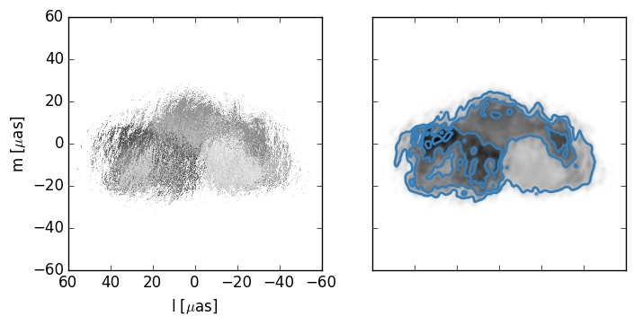
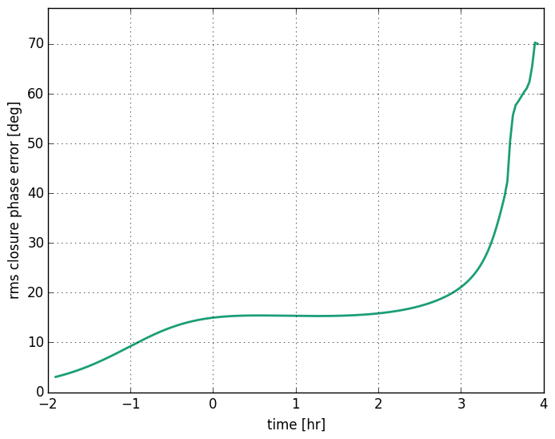

.. module:: scatterbrane

.. _cperrors:

Closure phase errors 
====================

This example demonstrates how to estimate the root mean squared error in closure 
phase induced by scattering.  The python script covers:

1. Scattering an image
2. Generating multiple instances of the screen
3. Generating uv samples for closure phase calculations
4. Calculating closure phases for an image including Earth rotation.
5. Calculating the rms closure phase error induced by scattering.

Closure phases are useful quantities for studying asymmetry
when your data has large station-specific phase noise.
To compute a closure phase you sum the phases over three directed baselines 
that represent a closed geographic triangle.  While these quantities can
be rather unintuitive, it is useful to know that for source with rotational 
symmetry the closure phase is zero.  So in the ensemble-average regime,
scattering introduces no error in the closure phase.  However, for the
distortions introduces in the average image will change the closure phase. 
The error is dependent upon both the source structure and the screen.

First we will load modules and do some basic configuration:

.. code-block:: python

    from scatterbrane import Brane,Target,utilities
    import numpy as np
    import time
    from scipy.ndimage import imread
    import matplotlib.pyplot as plt
    plt.rcParams['image.cmap'] = 'gray_r'
    plt.rcParams['image.origin'] = 'lower'

    # set up logger
    import logging
    logging.basicConfig(level=logging.INFO)
    logger = logging.getLogger()

Now we will load our source image and arbitrarily choose its pixel size.  Note that I flip the y-axis (axis=0)
of the image so that increasing index corresponds to our intuition of up.  Scatterbrane assumes that the background
level corresponds to 0 so I also invert the color scale.

.. code-block:: python

    # import our source image and covert it to gray scale
    src_file = 'source_images/640px-Bethmaennchen2.square.jpg'
    rgb = imread(src_file)[::-1]
    I = 255 - (np.array([0.2989,0.5870,0.1140])[np.newaxis,np.newaxis,:]*rgb).sum(axis=-1)
    I = I*np.pi/I.sum()

    # and smooth image
    I = utilities.smoothImage(I,1.,8.)

    # make up some scale for our image. Let's have it span 120 uas.
    wavelength=1e-3
    FOV = 120.
    dx = FOV/I.shape[0]

Our source image and blurred by Gaussian with a full width at half maximum of 10 microarcseconds:

.. image:: ../_static/cp_errors/src.png

We'll initialize the scattering screen and the observing parameters for calculating closure phases:

.. code-block:: python

    # initialize the scattering screen @ 1mm
    b = Brane(I,dx,wavelength=1.e-3,nphi=2**13)

    # initialize Target object for calculating visibilities and uv samples
    sgra = Target(wavelength=1.e-3)
    # calculate uv samples for our closure phase triangle and on the source image
    site_triangle = ["SMA","ALMA","LMT"]
    (uv,hr) = sgra.generateTriangleTracks(sgra.sites(site_triangle),times=(0.,24.,int(24.*60./2.)),return_hour=True)

    # closure phases for the source image
    CP_src = sgra.calculateCP(b.isrc,b.dx,uv)

uv is a numpy array with the individual (u,v) pairs separated by 2 minutes. Our closure phase triangle has been set
as the SMT, ALMA, and LMT observatories.

.. image:: ../_static/cp_errors/uv_track.png

Now we will calculat the closure phaes for a bunch of scattered images using a different phase screen each time.  I 
set the number to take about 10 minutes.

.. code-block:: python

    def one_sim(i):
        ''' helper function to run one simulation '''
        global sgra,b,CP
        b.generatePhases()
        b.scatter()
        CP.append(sgra.calculateCP(b.iss,b.dx,uv))

    # initialize list
    CP = []

    # estimate time for one simulation
    tic = time.time()
    one_sim(0)

    # run enough to take about 10 minutes
    num_sim = int(10*60. / (time.time()-tic))
    logger.info('running {0:g} simulations'.format(num_sim))
    tic = time.time()
    for i in xrange(1,num_sim):
        one_sim(i)
    CP = np.asarray(CP)
    logger.info('took {0:g}s'.format(time.time()-tic))

Here is the result for one simulation:

Using our results we can calculate the rms error:

.. code-block:: python

    # calculate rms error of closure phase array (CP)
    wrapdiff = lambda angle1,angle2: np.angle(np.exp(1j*angle1)/np.exp(1j*angle2))
    rms_CP = np.sqrt(np.mean((wrapdiff(CP,CP_src[np.newaxis,:]))**2,axis=0))

and plot it:

